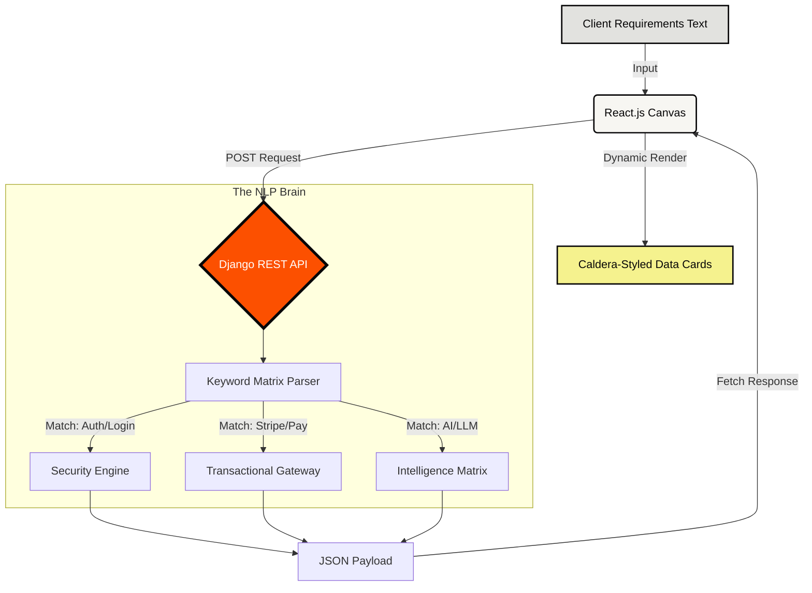

# CodeArrest Scope Engine

> **Automated, NLP-driven technical scoping matrix.**

The CodeArrest Scope Engine is an internal AI tool designed to instantly parse raw client requirements and output structured technical architectures, complete with estimated timelines, module categories, and tech stacks.

##  Architecture & Data Flow



## The Design System
The frontend completely abandons standard SaaS gloss in favor of a strictly functional, 90s editorial risograph-zine aesthetic:
* **Concrete Canvas:** `#e2e2df` matte stone backgrounds.
* **Citra Orange:** `#fc5000` reserved strictly for primary actions and massive stat cards.
* **Typography:** Brutalist `PP Neue Corp Compact` for magazine-style display headers, paired with `DM Sans` for readable technical body text.
* **Geometry:** Aggressive 40px border-radii with zero drop-shadows to maintain a flat, printed feel.

## Technical Stack
* **Frontend:** React.js, Vite, Native CSS Custom Properties (Tokens)
* **Backend:** Python, Django, `django-cors-headers`
* **Logic:** Native Python Regular Expressions (Regex) NLP Matrix

## Local Launch Sequence

To run the Scope Engine locally, you will need two terminal instances.

### 1. Boot the Backend (Django)
```bash
cd backend
python -m venv venv
# On Windows: .\venv\Scripts\activate
# On Mac/Linux: source venv/bin/activate
pip install -r requirements.txt
python manage.py runserver
```
*The engine will start listening on `http://127.0.0.1:8000/`*

### 2. Boot the Frontend (Vite)
Open a new terminal in the root directory:
```bash
cd frontend
npm install
npm run dev
```
*The canvas will render on `http://localhost:5173/`*

## Testing the Matrix
Once the UI is live, paste the following prompt into the text canvas to test the expanded logic triggers:

> *"I need a highly specialized AI Chatbot for my clothing brand that helps people build their own outfits based on their personality, skin tone, body type, personal taste and fashion style, securely linked to a payment gateway."*

The engine will instantly detect the intelligence, algorithmic, and transactional keywords and generate the accurate scoping cards.
The engine will instantly detect the intelligence, algorithmic, and transactional keywords and generate the accurate scoping cards.
